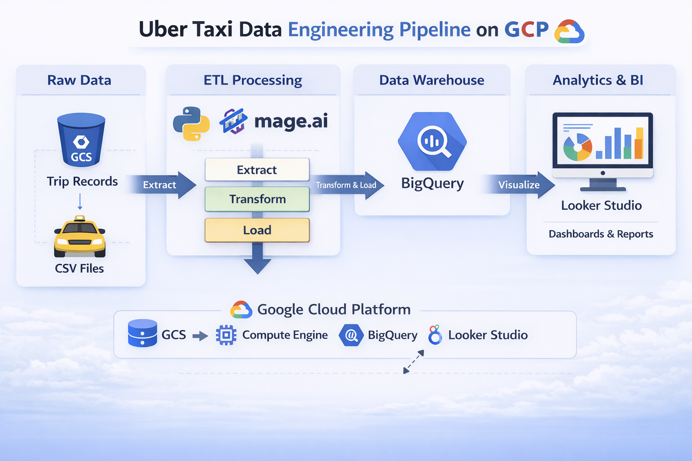

# Uber-Taxi--Data-Pipeline-Project
End-to-end data engineering pipeline on Google Cloud Platform for processing Uber trip data using Mage.ai, BigQuery, and Looker Studio for analytics and dashboard visualization.

# 🚕 NYC Taxi Data Engineering Pipeline on GCP

## 📌 Project Overview

This project implements an end-to-end **batch data engineering pipeline** on Google Cloud Platform (GCP) to process and analyze NYC Taxi & Limousine Commission (TLC) trip record data.

The pipeline demonstrates modern data engineering best practices including:

* Cloud data lake ingestion
* ETL orchestration using Mage.ai
* Dimensional data modeling (Star Schema)
* Cloud data warehousing with BigQuery
* Business intelligence visualization using Looker Studio

The final solution enables analytics on trip demand patterns, revenue trends, and operational insights.

---

## 🏗️ Architecture

### Data Flow

Raw Data (GCS)
→ Compute Engine (Python Processing)
→ Mage.ai Pipeline (Extract → Transform → Load)
→ BigQuery Data Warehouse
→ Looker Studio Dashboard

### 📊 Architecture Diagram

```

```

---

## 🛠️ Technology Stack

### Programming Language

* **Python** — Data transformation, pipeline scripting, automation

### ☁️ Google Cloud Platform Services

| Service                    | Purpose                                       |
| -------------------------- | --------------------------------------------- |
| Google Cloud Storage (GCS) | Raw data lake for storing source CSV files    |
| Compute Engine             | Hosts Mage.ai pipeline server                 |
| BigQuery                   | Serverless cloud data warehouse for analytics |
| Looker Studio              | Dashboarding and business intelligence        |

### 🔧 Data Pipeline Orchestration

* **Mage.ai** — Open-source modern data pipeline tool for ETL workflows

---

## 📂 Dataset

### NYC TLC Trip Record Data

This project uses the **NYC Taxi & Limousine Commission (TLC) Trip Record dataset**.

Trip records contain:

* Pick-up and drop-off timestamps
* Pick-up and drop-off locations
* Trip distances
* Fare and payment details
* Rate codes
* Passenger counts

### Dataset Resources

* TLC Trip Data Website
* Yellow Taxi Data Dictionary (PDF)

---

## 🗂️ Data Model

The raw trip dataset is transformed into a **star schema data model** optimized for analytical queries.

### ⭐ Fact Table

**fact_trips**

* Trip ID
* Pickup & dropoff timestamps
* Trip distance
* Fare amount
* Location IDs
* Rate code
* Payment type
* Passenger count

### 📘 Dimension Tables

| Table                | Description                                |
| -------------------- | ------------------------------------------ |
| dim_datetime         | Hour, day, month, year, weekday attributes |
| dim_pickup_location  | Pickup latitude & longitude                |
| dim_dropoff_location | Dropoff latitude & longitude               |
| dim_rate_code        | Rate category names                        |
| dim_payment_type     | Payment method details                     |
| dim_passenger_count  | Passenger count categories                 |
| dim_trip_distance    | Distance metrics                           |

---

## 🚀 Getting Started

### ✅ Prerequisites

* Python 3.8+
* Google Cloud Platform account with billing enabled
* gcloud CLI configured
* Mage.ai installed

## 📊 Pipeline Overview

The Mage.ai workflow consists of three main stages:

* **Extract** → Load raw CSV data from Google Cloud Storage
* **Transform** → Apply star schema transformations
* **Load** → Store structured tables in BigQuery

After loading, Looker Studio connects to BigQuery for building dashboards that visualize:

* Peak taxi demand hours
* Revenue trends
* Trip distribution by location
* Payment behavior insights

---

## 📈 Key Insights (Example)

* Evening hours show highest taxi demand
* Manhattan generates the largest share of revenue
* Credit card payments dominate overall transactions
* Average trip distance is under 3 miles

---

## ⭐ Project Highlights

* Designed scalable cloud-native batch data pipeline
* Implemented dimensional data modeling in BigQuery
* Built production-style ETL orchestration using Mage.ai
* Enabled analytical reporting through BI dashboards
* Demonstrated end-to-end modern data engineering workflow

---

## 📁 Project Structure

```
uber-data-engineering-gcp/
│
├── data/                  # Raw / sample datasets
├── mage_pipeline/         # Mage.ai pipeline components
│   ├── extractors/
│   ├── transformers/
│   └── loaders/
├── notebooks/             # Exploratory data analysis
├── scripts/               # Utility Python scripts
├── requirements.txt
└── README.md
```

---

## 🤝 Contributing

Contributions are welcome.
Please open an issue or submit a pull request.

You may also contribute to the Mage.ai open-source project.

---

## 📄 License

This project is licensed under the **MIT License**.

---

## 🙏 Acknowledgements

* NYC Taxi & Limousine Commission for open dataset
* Mage.ai open-source community
* Google Cloud Platform for cloud infrastructure


